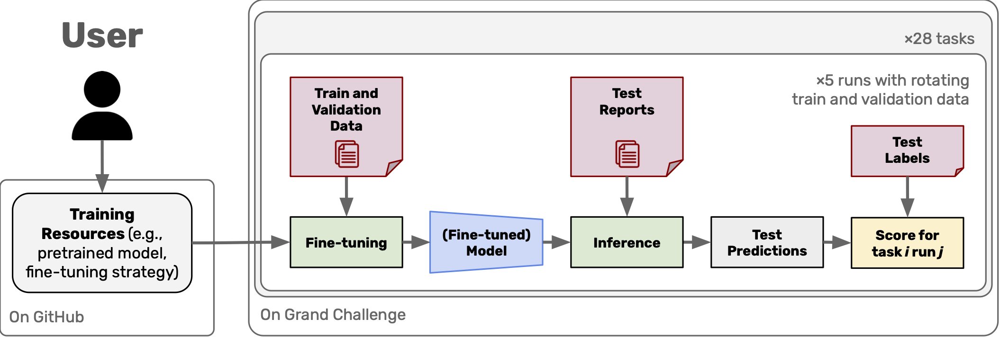

# DRAGON Development Guide

Submissions to the DRAGON challenge need to generate predictions for the test set of each task. The predictions should be stored in a specific format, as described in the [dataset convention](/documentation/dataset_convention.md). The predictions are then evaluated on the Grand Challenge platform. To generate the predictions, examples from the training set may be used. These examples can be used to fine-tune a model, provide few-shot examples, or be used in any other way to generate predictions for the test set. For model selection, the validation set may be used. 

To facilitate the development of algorithms, we provide a [submission template](https://github.com/DIAGNijmegen/dragon_submission) that solves each task using a BERT-like model. Alternatively, when using generative models, [this template]((https://github.com/DIAGNijmegen/dragon_submission_llm_extractinator_gemma2)) uses LLMs (Gemma2 using the Ollama framework) and can be used as starting point.

Additionally, we provide synthetic datasets that can be used for debugging and testing.

Note: the validation set may not be used as additional training data, such that the robustness of the algorithm can be assessed through the cross-validation setup of the DRAGON benchmark.

## Format for submissions
Submissions to the DRAGON challenge are to be made as Docker containers. Thse Docker containers must encapsulate **all training resources** (e.g., pretrained model weights, fine-tuning strategy, and/or prompting strategy with few-shot examples) and the components needed to **generate predictions** for the test cases. The flow for submissions is shown below. Technically, these containers are [Grand Challenge (GC) algorithms](https://grand-challenge.org/documentation/algorithms/) with standardised input and output data handling. We highly recommend  the general tutorial on creating
Grand Challenge Algorithms: <a href="https://grand-challenge.org/documentation/create-your-own-algorithm/" target="_blank">https://grand-challenge.org/documentation/create-your-own-algorithm/</a>.



*Figure: Evaluation method for the DRAGON benchmark. Challenge participants must provide all resources necessary to process the reports and generate predictions for the test set. Any processing of reports is performed on the Grand Challenge platform, without any interaction with the participant.*


## Setup for development
The DRAGON baseline algorithm provides a common solution to all tasks in the DRAGON benchmark. This algoritm was evaluated on the DRAGON benchmark across five architectures and three pretraining strategies, and some of its strengths and weaknesses are described [here](/README.md#where-does-the-dragon-baseline-perform-well-and-where-does-it-not-perform).

Rather than directly adapting the DRAGON baseline repository, we recommend making a fork of the [DRAGON submission repository](https://github.com/DIAGNijmegen/dragon_submission) as a template for your solution. This brings in everyting of the DRAGON baseline, as well as documentation on how to make code changes. A clear benefit from starting with the [DRAGON submission repository](https://github.com/DIAGNijmegen/dragon_submission) is that code changes made by you stand out from the code in the DRAGON baseline. This in turn makes it easy to maintain and upgrade to improved versions of the baseline once those come along.

After making the fork, clone it. For the sake of this tutorial, we will assume you put your repositories in the `~/repos` folder (feel free to change this to any other directory). Please replace `{YOURUSERNAME}` with your GitHub username.

```bash
cd ~/repos
git clone https://github.com/{YOURUSERNAME}/dragon_submission
```

This brings in all necessary steps for data loading, validation, preprocessing, training, inference, and storing and verifying the predictions. Every aspect of the baseline approach can be adapted, for which we provide examples in the aforementioned repository.


## Validating the setup
Before implementing your algorithm using this template, we recommend to test whether setup was completed successfully. This will also test whether your hardware setup is suitable. The baseline was tested on [these systems](/documentation/system_requirements.md). 


### Option 1: Working in Docker
You must have
<a href="https://docs.docker.com/get-docker/" target="_blank">Docker</a>
installed and running on your system for the following steps to work. If
you are using Windows, we recommend installing
<a href="https://docs.microsoft.com/en-us/windows/wsl/install" target="_blank">Windows Subsystem for Linux 2 (WSL2)</a>. For more
details, you can watch the
<a href="https://www.youtube.com/watch?v=PdxXlZJiuxA" target="_blank">official tutorial by Microsoft for installing WSL 2 with
GPU support</a>.

Once Docker is installed, start with building the Docker container:

```bash
cd ~/repos/dragon_submission
./build.sh
```

If ran successfully, this should result in the Docker container named `joeranbosma/dragon_submission:latest`.

Then, test your setup by training and evaluating on the synthetic datasets. To do so, run:

```bash
cd ~/repos/dragon_submission
./test.sh
```

Note: testing also runs a build, so running the build command separately is optional (if you are certain that everything is set up correctly).

Testing involves fine-tuning your algorithm on the nine synthetic datasets provided in the <a href="https://github.com/DIAGNijmegen/dragon_submission/tree/main/test-input" target="_blank">`test-input`</a> folder. It will then generate and check the test predictions produced by your algorithm against the labels and display the performance. Since training is typically not deterministic (even with the same random seed across different hardware), we don't compare against pre-computed test predictions. Instead, we print the performance and ask you to check if all training runs perform better than random guessing. If this is successful, you're good to go!

If you want to adapt the hardware (e.g., run on CPU instead of GPU, or allow more/less RAM, CPU cores, etc.) you can adapt the <a href="https://github.com/DIAGNijmegen/dragon_submission/blob/main/test.sh" target="_blank">`test.sh`</a> file.


### Working in an IDE (e.g., Visual Studio Code)
Alternatively, you can develop outside a Docker container. This introduces more differences between the development environment and the submission environment on Grand Challenge, but may better fit your development preferences. For this, we strongly recommend that you install everyting in a virtual environment! Pip or anaconda are both fine. Use a recent version of Python! 3.9 or newer is guaranteed to work! For the sake of this tutorial, we will use a conda environment with Python 3.11.

```bash
conda create --name=dragon_submission python=3.11
conda activate dragon_submission
cd ~/repos/dragon_submission
pip install -r requirements.txt
```

This was tested on Ubuntu 22.04. If you have issues installing the <a href="https://github.com/DIAGNijmegen/dragon_submission/blob/main/requirements.txt" target="_blank">`requirements.txt`</a>, you can try the adapted variant below. This should install all requirements, but doesn't fully specify all versions and dependencies:

```bash
cd ~/repos/dragon_submission
pip install torch  # needed first for the xformers package
pip install -r requirements.in
```

If this was all successful, you can open the repository in an IDE and select the `dragon_submission` environment to run the code in. When running on Mac, xformers version 0.0.21 may work better (`pip install xformers==0.0.21`).

To validate the setup works as intended, run the <a href="https://github.com/DIAGNijmegen/dragon_submission/blob/main/test.py" target="_blank">`test.py`</a> script to train on the synthetic datasets. This will fine-tune the model for each of the nine synthetic debugging datasets, so this can take a while.


## Developing Your Own Solution
After the setup above you're good to go to implement your own AI algorithm! The most logical place to start adapting is the <a href="https://github.com/DIAGNijmegen/dragon_submission/blob/main/process.py" target="_blank">`process.py`</a> script, there are two example alterations provided there too. Any additional imported packages should be added to <a href="https://github.com/DIAGNijmegen/dragon_submission/blob/main/requirements.txt" target="_blank">`requirements.txt`</a>, and any additional files and folders should be explicitly copied through commands in the <a href="https://github.com/DIAGNijmegen/dragon_submission/blob/main/Dockerfile" target="_blank">`Dockerfile`</a>. 

To update your algorithm on Grand Challenge, you can test your new Docker container, after which you can update the forked repository and **tag** it (following the instructions
<a href="https://grand-challenge.org/documentation/linking-a-github-repository-to-your-algorithm/" target="_blank">here</a>).

Please note, you only have internet access when **building** the Docker container on Grand Challenge, not while generating predictions for the test sets. Therefore all necessary model weights and resources must be encapsulated in your container image apriori. Using an API to generate predictions is not possible. You can test whether your algorithm runs without internet using the `--network=none` option of `docker run`.

If anything is unclear or something doesn't work for you, please feel free to
<a href="https://github.com/DIAGNijmegen/dragon_submission/issues" target="_blank">make an issue in the DRAGON submission GitHub</a>.


## Submitting Your Algorithm
For more information about submission to the DRAGON benchmark, please check out the [algorithm submission guide](https://dragon.grand-challenge.org/submission/).
